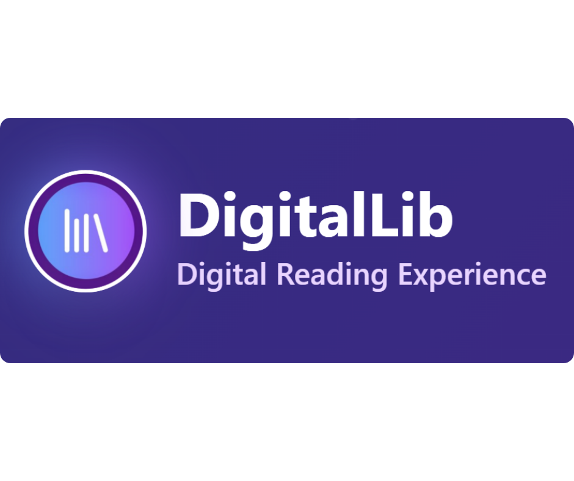
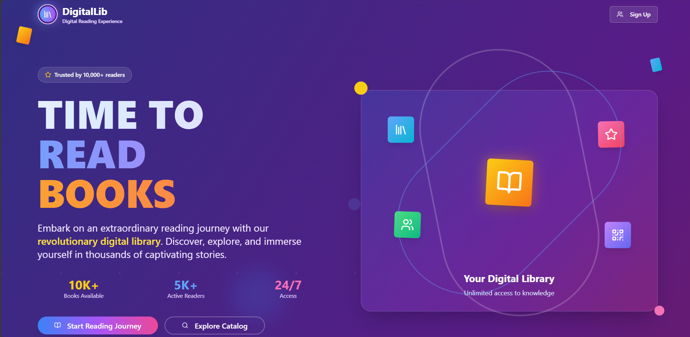

  

  <b>Online Library Management System for Colleges</b> 
  <i>A modern, responsive, and powerful platform for managing books, members, and digital resources.</i>

---

## 🌐 Live Demo

🚀 [Visit Live Site](#) &nbsp; | &nbsp; 🔐 [Admin Panel](#) &nbsp; | &nbsp; 📖 [Student Portal](#)

---

## 📸 Landing Page Preview

  

---

## 🔥 Key Features

### 🎯 Hero Section
- 🟣 **“TIME TO READ BOOKS”** headline with gradient background
- 🖼️ Book-themed floating illustrations
- 🔐 Login/Register modals on interaction

### ✨ Library Highlights
- 📚 **Vast Collection** – Search by title, author, genre
- 🔎 **Smart Search** – Real-time filtering
- 👥 **Member Management** – Students, roles, issue tracking
- 📱 **Digital Access** – Read PDFs inside the app

### 🔁 Issue & Return
- Track availability
- Auto fine calculation
- Reservation queue system

### 📊 Analytics & Insights
- Top borrowed books
- Fine stats, overdue alerts
- CSV report export

---

## 👩‍💻 Tech Stack

| Layer     | Tech Used |
|-----------|-----------|
| 💻 Frontend | React, TypeScript, TailwindCSS, Framer Motion |
| 🔧 Backend  | Node.js, Express |
| 🗃️ Database | MongoDB |
| 🔐 Auth     | JWT with Role-Based Access |
| 🧰 Tools    | PDF.js, Barcode Scanner, CSV Export |

---

## 🚧 Upcoming Features

These exciting features are in the pipeline to enhance the DigitalLib experience even further:

- 📱 **Mobile App (React Native)** – Access library on the go  
- 🧠 **AI-Based Recommendations** – Suggest books based on user behavior  
- 🗂️ **Bulk Book Upload** – Upload via CSV or Excel  
- 🔍 **OCR Book Search** – Scan and search physical books via camera  
- 🛡️ **Admin Logs & Audit Trail** – Full activity tracking  
- 🖼️ **Dark Mode** – Accessible and visually sleek interface  
- 🗓️ **Event Calendar** – Schedule and display library events/workshops  
- 🧾 **Borrow History Export** – PDF/CSV export of personal borrowing record  
- 🧑‍🏫 **Faculty Dashboard** – Special tools and stats for teaching staff  
- 🧾 **Library Card Generator** – Auto-generate digital library ID cards

Stay tuned — DigitalLib is evolving fast 🚀

---

## 🙌 Acknowledgements

Gratitude to the tools, libraries, and communities that made this project possible:

- 🎨 [TailwindCSS](https://tailwindcss.com/) – Utility-first CSS magic ✨  
- ⚛️ [React](https://reactjs.org/) & [Vite](https://vitejs.dev/) – Fast frontend dev  
- 📚 [PDF.js](https://mozilla.github.io/pdf.js/) – Seamless PDF viewing  
- 📦 [MongoDB Atlas](https://www.mongodb.com/cloud/atlas) – Scalable DB backend  
- 🔐 [JWT.io](https://jwt.io/) – Secure token-based authentication  
- 🖼️ [Heroicons](https://heroicons.com/) & [Lucide](https://lucide.dev/) – Clean icons  
- 🛠️ [Render](https://render.com/) / [Railway](https://railway.app/) – Easy backend hosting  
- 💬 [OpenAI](https://openai.com/) – Ideation and debugging help

A big thanks to all open-source contributors and the developer community 🌍❤️
---
---

## 🤝 Contributing

Contributions are welcome! If you have ideas, bug fixes, or improvements, feel free to:

- ⭐ Star the repo  
- 🍴 Fork the project  
- 🛠️ Submit a pull request  
- 🐞 Open an issue  

Every contribution makes **DigitalLib** better. Thank you for your support! 💙

---

## 👩‍💻 Created By

**Janavi Zala**  
📧 [janavizala0612@gmail.com](mailto:janavizala0612@gmail.com)  
🔗 [LinkedIn](https://www.linkedin.com/in/janavi-zala-226117288/) • [GitHub](https://github.com/Janavizala06)

